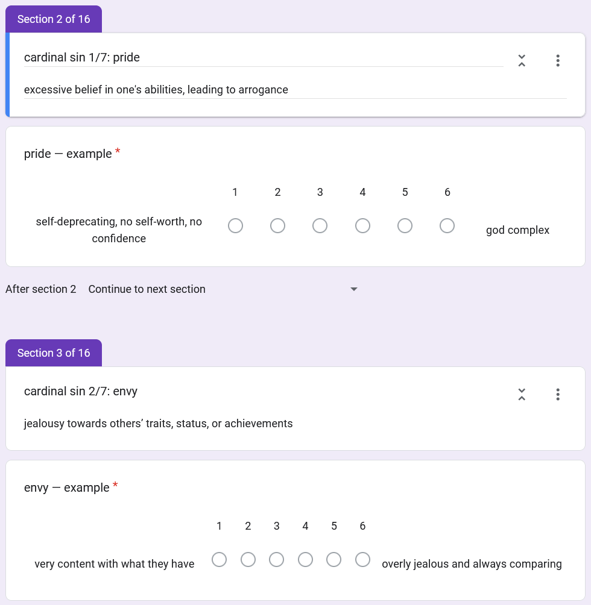
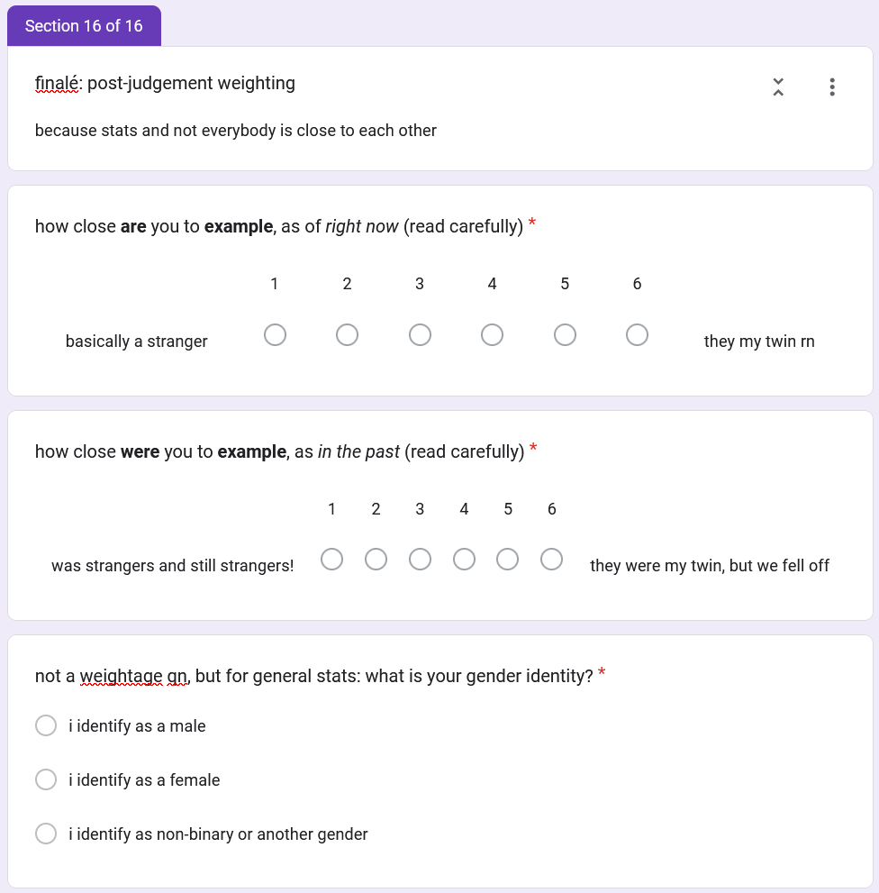
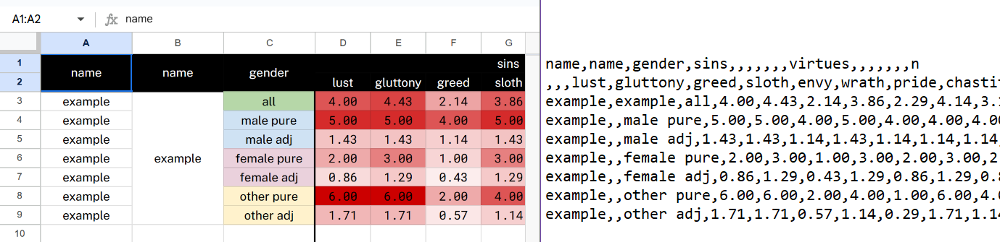

# sins and virtues

automating adobe illustrator with python for a silly form we made:  
a joint project by lumi, anterillynn and mark

- [what is this?](#what-is-this)
- [cool, i wanna try it out](#cool-i-wanna-try-it-out)
    - [prerequisites](#prerequisites)
    - [data collection: google forms](#data-collection-google-forms)
    - [data processing: google sheets](#data-processing-google-sheets)
    - [using the script itself](#using-the-script-itself)
- [licence](#licence)
    - [source code](#source-code)
    - [the graph illustrator file](#the-graph-illustrator-file)

by the way, if you're here because it's one of the few public projects that string
together illustrator and python, it's [unlicenced](#source-code) so do whatever

and if you're wondering how i could puppeteer illustrator, some adobe apps have
a scripting interface that you can use to automate tasks, like illustrator's

usually this is done through javascript but i'm hardheaded and used python instead,
via pywin32, the windows' [component object model](https://en.wikipedia.org/wiki/Component_Object_Model)
interface, and deciphering the one illustrator vbscript reference guide pdf i found

## what is this?

there was a little trend on tiktok that made its way into my social circles

people would fill out a form with polls like 'who is the most likely to get arrested'
or 'who is the most likely to get married first'

it was cool i guess? got a few laughs out of it - but a few months later,
around end-august where i had a stats and data visualisation project,
i went 'oh wait what about the seven deadly sins, that'd be neat'

so i cooked up a google form and then eventually also realised i needed to
also do the seven heavenly virtues

i did make a graph-like display in google sheets, but yeah, no, that wasn't cutting it

and then i wondered if i could automate illustrator to do my bidding because i was
trying to do 16 graphs by hand

so here we are!

## cool, i wanna try it out

uhh, unless you know me i'm not going to give any warranty (see the [licencing](#licence)!),
so you're on your own

(but feel free to ask _nicely_ in the github/forge issues or through email)

### prerequisites

- [python 3.10 or later](https://www.python.org/downloads/)
- [poetry](https://python-poetry.org/docs/#installation) or just installing [pywin32](https://pypi.org/project/pywin32/)
- adobe illustrator versions released after 2013(?)  
  (the
  [vbscript reference](https://citeseerx.ist.psu.edu/document?repid=rep1&type=pdf&doi=7d83f8592174c956d45892b11e310e5db5e45353)
  i used was released in 2013 but still works as of **illustrator cc 2024**)
- [rena](https://fontesk.com/rena-font/) by eli heuer and published by font garden

### data collection: google forms

if you want the best chances of not having silly errors somewhere down the line,
format the form like this:

1. **question texts for each sin/virtue value**

   

   the order doesn't really matter, but remember to replace 'example' with
   your name or your friends' names

   neither what you use as the text for the upper and lower bounds of the range,
   choose one that best fits your groups' lingo or something

   (but do remember that each end of the ranges is an extreme!
   e.g. if you're too prideful, that's bad! who would've guessed!)

   **important:** the separator used is not a normal hyphen, the one on your keyboard,
   but an em dash (—). copy it from below:

   ```text
   pride — example
   envy — example
   gluttony — example
   lust — example
   wrath — example
   greed — example
   sloth — example

   humility — example
   kindness — example
   temperance — example
   chastity — example
   patience — example
   charity — example
   diligence — example
   ```

2. **closeness question texts**

   

   either follow the text i've used in the image and text below, or
   change the formulas in columns `processing!R` and `processing!S` to match your text

   once again, the order doesn't really matter, but remember to replace 'example' with
   your name or your friends' names

   ```text
   how close are you to example, as of right now (read carefully)
   how close were you to example, as in the past (read carefully)
   ```

3. **use a 1-6 scale (or preprocess your input)**

   i chose a scale from 1-6 because you can't have a medium that is neutral,
   that's boring! and in the realm of psychology, it produces unhelpful data points
   (or so my social psych lecturer said)

   if you use a different scale, you'd need to preprocess your linked form sheet
   to use 1-6 scales beforehand

### data processing: google sheets

i only started using python when i wanted to automate the process of
creating better-looking graphs  
...so you're stuck with my lovecraftian sheet/excel formulas in the off-but-likely chance
you ever need to try to fix something

if you're lazy to process data yourself, and i can't blame you at all
(it took me a day or two, albeit on and off), i've templated the google sheet i used:
[`google_sheets_template.xlsx`](google_sheets_template.xlsx)

if you use the template, here's a quickstart (or really just a showcase)
on how to import and process your own input: [`dataprocessingclub.mp4`](docs/dataprocessingclub.mp4)

https://github.com/user-attachments/assets/c111e6ba-b4e2-4a46-bce5-b15c5c445630

(i copy and paste an example form response as input,
but it works the same if you link google form responses to the sheet)

then again, as long as you spit out something like the [`detailed-example.csv`](detailed-example.csv)
example file, the script will happily eat it up

also, there are two name columns because it looked prettier in google sheets:



### using the script itself

1. clone this repo

2. open illustrator

3. click on an object on the artboard you want to use  
   (default is the 'Template' artboard, which uses the 'Working' layer)

4. open a terminal and navigate to the directory where you've cloned this repo,  
   or right-click in the directory and click on 'Open in Terminal' or 'Open in PowerShell'

5. run `poetry run python sinsandvirtues.py`  
   (or `poetry shell` and then `python sinsandvirtues.py`)

to use the alternate design/artboard, specify `'WorkingAlt'` as target layer when you run it
(and remember to click on an object to focus on the artboard)

you might want to specify a non-default export prefix or suffix if you do that though to
not overwrite the default design exports (i set the export suffix to `-alt` personally)

**tip:** if it seems like it's taking forever, a silly trick i've found is to focus on
adobe illustrator and then refocus/switch back to the terminal/console

## licence

- [source code](#source-code)
- [the graph illustrator file](#the-graph-illustrator-file)

### source code

the code, [`sinsandvirtues.py`](sinsandvirtues.py), is licensed under the Unlicence

see the full text below, in the [`UNLICENCE`](UNLICENCE) file,
or at [unlicense.org](https://unlicense.org/)

```text
This is free and unencumbered software released into the public domain.

Anyone is free to copy, modify, publish, use, compile, sell, or
distribute this software, either in source code form or as a compiled
binary, for any purpose, commercial or non-commercial, and by any
means.

In jurisdictions that recognize copyright laws, the author or authors
of this software dedicate any and all copyright interest in the
software to the public domain. We make this dedication for the benefit
of the public at large and to the detriment of our heirs and
successors. We intend this dedication to be an overt act of
relinquishment in perpetuity of all present and future rights to this
software under copyright law.

THE SOFTWARE IS PROVIDED "AS IS", WITHOUT WARRANTY OF ANY KIND,
EXPRESS OR IMPLIED, INCLUDING BUT NOT LIMITED TO THE WARRANTIES OF
MERCHANTABILITY, FITNESS FOR A PARTICULAR PURPOSE AND NONINFRINGEMENT.
IN NO EVENT SHALL THE AUTHORS BE LIABLE FOR ANY CLAIM, DAMAGES OR
OTHER LIABILITY, WHETHER IN AN ACTION OF CONTRACT, TORT OR OTHERWISE,
ARISING FROM, OUT OF OR IN CONNECTION WITH THE SOFTWARE OR THE USE OR
OTHER DEALINGS IN THE SOFTWARE.

For more information, please refer to <http://unlicense.org/>
```

### the graph illustrator file

the illustrator file, [`sinsandvirtues.ai`](sinsandvirtues.ai),
and **derivative works like exported images and modified versions of the file and their exports**,
are licensed under the [Creative Commons Attribution 4.0 Licence](https://creativecommons.org/licenses/by/4.0/)

all i ask for is attribution/credit, else go ham with it

also if you do want to modify it, you can move things around
and the script won't bat an eye as long as:

- nothing is ungrouped
- nothing is moved between groups/layers

it quite literally relies on the layer/object structure,
a la `'Working' Layer > 'LustChastity' Group > 'Left1' Circle/Object/PathItem`

could i have coded it better? yeah, but that's always in retrospect  
(i mean the code _is_ unlicenced, you _can_ just one-up me and modify it, no holds barred)
